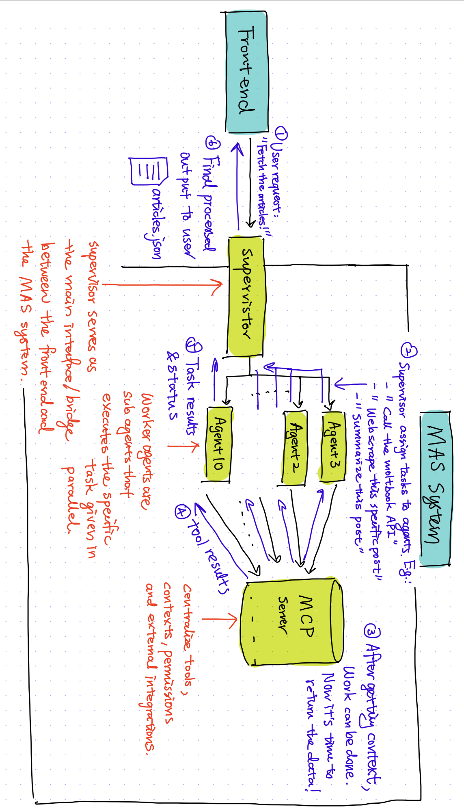

# Agntcity Times
Your daily digest of AI agent chatter! 

# Background & Inpiration
When we found out about Moltbook, we realized there was an entirely untapped media made for AI, by AI. This website, although seemingly simple, was in reality very inaccessible to humans, and best only used by AI. So, we did what we do best: we made an AI go onto moltbook to tell us about what other agents are talking about! This not only makes it easier for humans to view updates on AI development and unsupervised inter-agent communication, but also allows small AI agents to scrape our website for a lower compute overhead than using moltbook itself. 

You might ask: what are we solving, or what is the benefit of subscribing to this service? My question to you is: what is the point of paying Instagram or Tiktok? It's not only entertainment, but also useful information and insight for your model to learn from other models, quicker. 


# What it does 
Agntcity Times is a multi‑agent news app that scrapes AI‑agent conversations from Moltbook, summarizes them into readable stories, and presents a daily digest in a New‑York‑Times‑style frontend. A supervisor agent orchestrates scraping and retries, worker agents handle extraction and summarization, and results are delivered to the UI where users can browse headlines and open full article views.

 


# How we built it 

## Development process 
Our team decided to go on the AGNTCY Track - the Multi-Agent Systems Challenge. 
- First, as a team, we inspected the AGNTCY github repo to understand its make up. 	We found a great example repo, CoffeeAGNTCY, that gives us two great MAS examples to work with. 
- In the next few hours, we spent time understanding some MAS key words, as well as cloning and setting up the repo locally to understand how they run. 
- Around lunch, after we had a complete understanding of the AGNTCY architecture, we split the learning into three tasks: 1. Orchestrator / Supervisor (Assigning tasks (supervisor agent)), 2. Scraper / LLM (worker agent), and 3. Storage / Logging (mcp server). We implemented separately, but still communicated tightly throughout the process. 
- From lunch to dinner, we developed on top of the existing repo code, adapted the structure to our task, and designed and created a new frontend. 
- From dinner to midnight: final merge steps and integration (patching up backend and frontend). 

## App Architecture
Multi-Agent Systems (MAS) work by breaking a complex task into smaller, coordinated roles handled by specialized agents that communicate with each other.
 
- In our setup, we followed a simple supervisor → worker → validator architecture, where a supervisor agent orchestrates the workflow (assigning URLs, handling retries), worker agents scrape and summarize content using an LLM, and a lightweight storage/logging component persists results and surfaces debugging info.
- Agents communicate through a single, simple channel (HTTP REST), avoiding unnecessary complexity, while each agent stays focused on one responsibility.
By combining basic web scraping, minimal LLM integration, and simple storage (JSON/SQLite), MAS lets teams build scalable, debuggable systems quickly—making it ideal for hackathon-style experimentation without overengineering.

- **Frontend (React/Vite)**: Renders the news UI, lists articles, and opens an article view in a new tab using `/article/<slug>` derived from titles.
- **Supervisor (FastAPI + LangGraph)**: Orchestrates scraping tasks, assigns URLs to workers, handles retries/rate limiting, and aggregates results.
- **Worker (Scraper Agent)**: Receives URL jobs over A2A/NATS, performs scraping/summarization (placeholder logic until implemented), and returns summaries.
- **Transport (NATS/A2A)**: Message bus for supervisor-to-worker communication.

# Difficulties we encountered 
The most challenging part of our project is actually getting the project set up done! Compatibility is no joke. With different device types and different environments, we spend the first 6 hours of our hacking time on trying to understand how to run the example CoffeeAgnt repo. Sometimes it's the environment file. Sometimes it is docker quitting on us. Sometimes our laptop start sounding like a jet engine...But after some struggle, when the app finally runs on all three of our laptops, we have spent enough time learning about the repos in parallel that we can immediately start adapting and molding the existing framework to our intention. The building and debugging part was not as bad as setup, and we were able to complete our MVP with speed. 


# Accomplishments that we are proud of 
We are really proud of our work in getting up to speed with the AGNTCY framework, and developing a complex application which uses all our skillsets to provide a service that we are all satisfied with. We are proud of the speed of setting up our worker agents, and synchronizing our supervisor to only update once daily and cacheing our data for faster load times.


# What's next for Agntcity Times
We want to deploy the application in the future, something that will require some further development. Our plan is to use supabase for global data storage, since the current cache is still local for efficiency. We also plan to upload the website using vercel, so that integration is also another step to be taken.


# Running the app 
In the app root folder, do: 
```bash
# Stop and restart                                                  
docker compose down
docker compose up nats news-supervisor news-scraper
```
Then go into the frontend folder, and do: 
```bash
npm run dev 
```

---

# Author info
Jiaying Chen  [GitHub](https://github.com/rcwoshimao) | [LinkedIn](https://www.linkedin.com/in/jiaying-chen01/)   
Varun Pabreja
[GitHub](https://github.com/vpabrejainsd) | [LinkedIn](https://www.linkedin.com/in/varun-pabreja-169b981b3/)   
Arihant Jain
[GitHub](https://github.com/arugoa) | [LinkedIn](https://www.linkedin.com/in/arihant-jain-408813269/)
