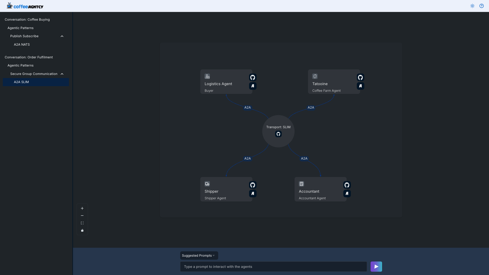

# Group Conversation

This document explains how to run the logistics multi-agent conversation locally (via Docker Compose or individual `make` targets) and how an order progresses through the system.

---

## 1. Services / Agents

| Role                | Python entrypoint                       | Purpose                                                         |
| ------------------- |-----------------------------------------| --------------------------------------------------------------- |
| logistics Supervisor | `agents/supervisors/logistics/main.py`  | Starts the workflow, handles user input, emits `RECEIVED_ORDER` |
| Shipper Agent       | `agents/logistics/shipper/server.py`    | Progresses shipping states (`CUSTOMS_CLEARANCE`, `DELIVERED`)   |
| Accountant Agent    | `agents/logistics/accountant/server.py` | Confirms payment (`PAYMENT_COMPLETE`)                           |
| Tatooine Farm Agent | `agents/logistics/farm/server.py`       | Moves order to `HANDOVER_TO_SHIPPER` after `RECEIVED_ORDER`     |

---

## 2. Order Lifecycle

Sequence (agent → state produced):

1. Supervisor → `RECEIVED_ORDER`
2. Farm Agent → `HANDOVER_TO_SHIPPER`
3. Shipper Agent → `CUSTOMS_CLEARANCE`
4. Accountant Agent → `PAYMENT_COMPLETE`
5. Shipper Agent → `DELIVERED` (final)

### Transition Table

| From State            | To State              | Responsible Agent |
| --------------------- | --------------------- | ----------------- |
| (User Prompt)         | `RECEIVED_ORDER`      | Supervisor        |
| `RECEIVED_ORDER`      | `HANDOVER_TO_SHIPPER` | Farm Agent        |
| `HANDOVER_TO_SHIPPER` | `CUSTOMS_CLEARANCE`   | Shipper Agent     |
| `CUSTOMS_CLEARANCE`   | `PAYMENT_COMPLETE`    | Accountant Agent  |
| `PAYMENT_COMPLETE`    | `DELIVERED`           | Shipper Agent     |

### Flow (ASCII)

```
User Prompt
↓
[Supervisor] → RECEIVED_ORDER → [Farm]
[Farm] → HANDOVER_TO_SHIPPER → [Shipper]
[Shipper] → CUSTOMS_CLEARANCE → [Accountant]
[Accountant] → PAYMENT_COMPLETE → [Shipper]
[Shipper] → DELIVERED (final)
```

---

## Run With Docker Compose (includes SLIM transport)

**Step 1: Run the SLIM Message Bus Gateway and Observability stack**

To enable A2A Group communication over SLIM, you need to run the SLIM message bus gateway.

Additionally, run the observability stack that includes OTEL Collector, Grafana, and ClickHouse DB. You can do this by executing the following command:

```sh
docker compose up slim clickhouse-server otel-collector grafana
```

**Step 2: Run the Group Conversation Stack**

If you want to run the group conversation stack separately, you can do so by running the following command:

```sh
docker compose up logistics-farm logistics-supervisor logistics-shipper logistics-accountant logistics-helpdesk
```

This will start the supervisor, shipper, accountant, farm, helpdesk,  and SLIM transport services.

---

## Run Individually (one terminal per service)

Terminal 1:

```sh
# The LLM env vars (e.g. `OPENAI_API_KEY`) are required for the logistics-supervisor.
make logistics-supervisor
```

Terminal 2:

```sh
make shipper
```

Terminal 3:

```sh
make accountant
```

Terminal 4:

```sh
make logistics-farm
```
Terminal 5:

```sh
make helpdesk
```

## Testing the Group Conversation

To test the group conversation, you can execute the following command:

```sh
curl -X POST http://127.0.0.1:9090/agent/prompt \
  -H "Content-Type: application/json" \
  -d '{
    "prompt": "I want to order  5000 lbs of coffee for 3.52 $ from the Tatooine farm."
  }'
```

Expected output:

```json
{
  "response": "Order ORD-3A7F5B2C from Tatooine for 500 units at $3.50 has been successfully delivered."
}
```

## Logistics Supervisor Streaming Endpoint

   > ⚠️ **Note:** The `/agent/prompt/stream` endpoint requires an LLM that supports streaming. If your LLM provider does not support streaming, the streaming endpoint may fail.

```bash
curl -X POST http://127.0.0.1:9090/agent/prompt/stream \
  -H "Content-Type: application/json" \
  -d '{
    "prompt": "I want to order 5000 lbs of coffee for 3.52 $ from the Tatooine farm."
  }'
```

Expected output:

```json
{"response": {"order_id": "40821a72-31e1-4da0-9bc0-ff519bc57c78", "sender": "Supervisor", "receiver": "Tatooine Farm", "message": "Create an order 40821a72-31e1-4da0-9bc0-ff519bc57c78 with price 3.52 and quantity 5000.", "state": "RECEIVED_ORDER", "timestamp": "2025-11-06T15:55:22.686634+00:00"}}

{"response": {"order_id": "40821a72-31e1-4da0-9bc0-ff519bc57c78", "sender": "Tatooine Farm", "receiver": "Shipper", "message": "Order 40821a72-31e1-4da0-9bc0-ff519bc57c78 handed off for international transit. Prepared shipment and documentation.", "state": "HANDOVER_TO_SHIPPER", "timestamp": "2025-11-06T15:55:23.223314+00:00"}}

{"response": {"order_id": "40821a72-31e1-4da0-9bc0-ff519bc57c78", "sender": "Shipper", "receiver": "Accountant", "message": "Customs cleared for order 40821a72-31e1-4da0-9bc0-ff519bc57c78; documents forwarded for payment processing. Customs docs validated and cleared.", "state": "CUSTOMS_CLEARANCE", "timestamp": "2025-11-06T15:55:24.228265+00:00"}}

{"response": {"order_id": "40821a72-31e1-4da0-9bc0-ff519bc57c78", "sender": "Accountant", "receiver": "Shipper", "message": "Payment confirmed on order 40821a72-31e1-4da0-9bc0-ff519bc57c78; preparing final delivery. Payment verified and captured.", "state": "PAYMENT_COMPLETE", "timestamp": "2025-11-06T15:55:25.233904+00:00"}}

{"response": {"order_id": "40821a72-31e1-4da0-9bc0-ff519bc57c78", "sender": "Shipper", "receiver": "Supervisor", "message": "Order 40821a72-31e1-4da0-9bc0-ff519bc57c78 delivered successfully; closing shipment cycle. Final handoff completed.", "state": "DELIVERED", "timestamp": "2025-11-06T15:55:26.241894+00:00"}}

{"response": "Order 40821a72-31e1-4da0-9bc0-ff519bc57c78 from Tatooine for 5000 units at $3.52 has been successfully delivered."}
```

## Group Communication UI



## Observability

See [Observability](../README.md#observability)
