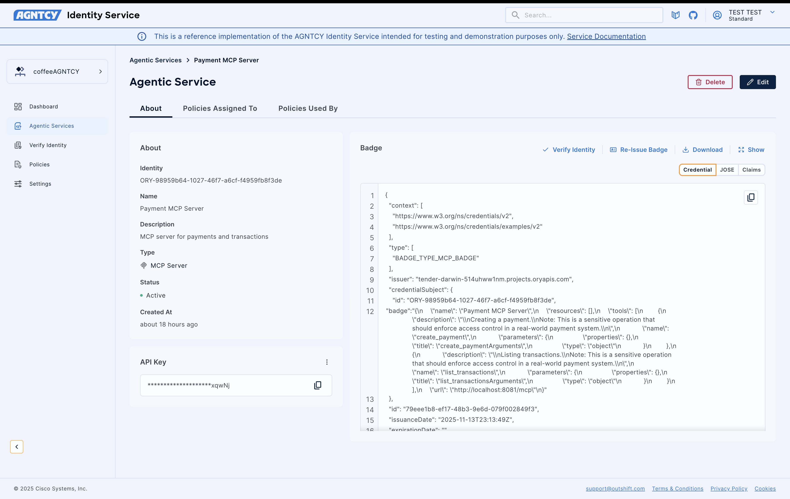

# Identity Integration Documentation

## TBAC Integration Overview

This guide explains how **Agntcy Identity TBAC (Tool-Based Access Control)** is integrated into the Acorda (Lungo) ecosystem. TBAC enables us to define, enforce, and audit authorization policies across multiple collaborating services, ensuring consistent and secure access control.

For more details on TBAC concepts, see:
[https://identity-docs.outshift.com/docs/policies](https://identity-docs.outshift.com/docs/policies)

**Acorda supports TBAC for:**

* **Point-to-Point**
* **Streaming**
* **Broadcasting / Multicasting**

**Protocols supported:**

* **Agntcy SLIM**
* **NATS**

---

## Service Badges Setup

> **If you are testing in your own Identity SaaS org:**
> Create badges **with the exact same names** listed below to ensure the demo works properly.

In Lungo, **service badges** represent the identity of each service in the auction workflow. Each badge includes identity attributes and roles used for authorization.

Badges created for the Lungo auction flow:

* **Auction Supervisor**
* **Vietnam Coffee Farm**
* **Colombia Coffee Farm**
* **Payment MCP Server**

These services collaborate during auction and order execution.

**Badges for Lungo Services:**


---

## Policies Configuration

Three TBAC policies are used in this setup:

1. **Colombia Farm Invocation Policy**
   Allows the **Auction Supervisor** to invoke the **Colombia Farm** service.

2. **Vietnam Farm Invocation Policy**
   Allows the **Auction Supervisor** to invoke the **Vietnam Farm** service.

3. **Payment MCP Tool Invocation Policy**
   Allows the **Colombia Farm** service to invoke **Payment MCP tools** (e.g., *list transactions*, *create payment*).

These demonstrate TBAC enforcement across multi-service interactions.

**Policies for Lungo Services:**


To recreate these policies in your own Identity SaaS org, follow:
[https://identity-docs.outshift.com/docs/agentic-service](https://identity-docs.outshift.com/docs/agentic-service)

---

## Obtaining API Keys

You will need **four API keys**, one for each service badge.

If using the demo environment, request keys from the CoffeeAGNTCY team or Agntcy Identity support.

> If using your own Identity SaaS instance, you can find each badge’s API key on the badge details page:
> 

Each service will use its corresponding badge key.

---

## Running With Docker Compose

Docker Compose reads per-service API keys from environment variables.
Add the following to your `'.env'` file:

```env
IDENTITY_AUTH_ENABLED="true"
IDENTITY_SERVICE_API_KEY_AUCTION_SUPERVISOR=supervisor_key
IDENTITY_SERVICE_API_KEY_PAYMENT_MCP=payment_mcp_key
IDENTITY_SERVICE_API_KEY_BRAZIL_FARM=brazil_key
IDENTITY_SERVICE_API_KEY_COLOMBIA_FARM=colombia_key
IDENTITY_SERVICE_API_KEY_VIETNAM_FARM=vietnam_key
```

Start the services:

```sh
docker compose up exchange-server payment-mcp-server brazil-farm-server colombia-farm-server vietnam-farm-server weather-mcp-server
```

Run without `.env` (inline key):

```sh
IDENTITY_SERVICE_API_KEY_AUCTION_SUPERVISOR=new_supervisor_key docker compose up exchange-server
```

**Production Recommendation:**
Use **only one environment variable** per service:
`IDENTITY_SERVICE_API_KEY`
Avoid multiple per-service variables.

---

## Running Locally (No Docker)

When running services locally (via `make` or `uv run`), each requires its own API key.

**Steps:**

1. Copy `'.env.example'` → `'.env'`
2. Ensure `IDENTITY_AUTH_ENABLED="true"` is set
3. Start each service with its correct badge key

**Example: Payment MCP**

```sh
IDENTITY_AUTH_ENABLED="true" IDENTITY_SERVICE_API_KEY='<payment_mcp_api_key>' make payment-mcp
```

**Other services (run separately):**

```sh
IDENTITY_AUTH_ENABLED="true" IDENTITY_SERVICE_API_KEY='supervisor_key' make auction-supervisor
IDENTITY_AUTH_ENABLED="true" IDENTITY_SERVICE_API_KEY='brazil_key' make brazil-farm
IDENTITY_AUTH_ENABLED="true" IDENTITY_SERVICE_API_KEY='colombia_key' make colombia-farm
IDENTITY_AUTH_ENABLED="true" IDENTITY_SERVICE_API_KEY='vietnam_key' make vietnam-farm
```

---

## How to Test the Integration

Use the **Lungo UI** to trigger interactions and observe TBAC enforcement.

### **Test Scenarios**

* **Broadcast:**
  *“List all inventories from all farms”*

* **Streaming:**
  *“List all inventories from all farms (streaming)”*

* **Point-to-Point:**
  *“Create order from Colombia Farm”*

### **Testing authorization changes**

1. Modify TBAC policies in Identity SaaS
2. Re-run the above prompts in the Lungo UI
3. Observe access **granted or denied** based on your policy edits

For details on editing policies, see:
[https://identity-docs.outshift.com/docs/policies](https://identity-docs.outshift.com/docs/policies)
